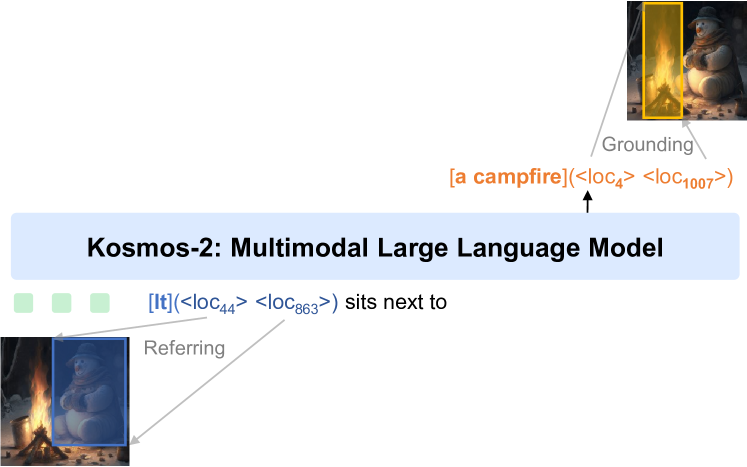

この記事では私が昨年B4の時に考案したマルチタスク学習手法について解説したいと思います。その前に考案した手法の適用先であるチーム研究の背景を解説します。

昨年、私を含む4人チームで**視覚言語モデル(VLM**)を一から構築する研究を行いました。研究背景としては2023年4月時点で画像と言語を扱えるVLMの数は少なく、VLM自体の構造・学習方法・学習データセットが明らかになっていない部分が多かったです。そのため、VLMを構築するために必要な要素技術を明らかにして公開すること、また研究室としてVLMを一から構築するノウハウを蓄積することを目的として研究に着手しました。最終的に「**GFM（Gifu Foundation Model**）」というVLMの構築に成功し、モデル自体の構築に関する研究成果は国際学会「[**IW-FCV-2024**](https://sites.google.com/view/iw-fcv2024/conference#h.xtqndf4telz0)」に採択され、モデルをHuman Object Interaction（HOI）に適用した研究成果は国内学会「[**DIA-2024**](https://www.tc-iaip.org/dia/2024/program.html#os3)」に採択されました。両論文では私は共著者とさせていただいています。また岐阜大学からも「[**低価格コンピュータで学習＆推論可能なAI基盤モデルを開発 -軽量かつ既存の大規模AIモデルと同程度の性能を達成-**](https://www.gifu-u.ac.jp/news/research/2024/02/entry21-13029.html)」としてプレスリリースしていただいています。

* 構築したモデル「GFM」の全体像
<!--いろいろ-->

<!--truncate-->
　具体的な研究の役割のチームでの分担は以下のようになっています。
<!--いろいろ-->
主な私の貢献(B4)
* **効率的かつスケーリング可能なマルチタスク学習の考案と実装**
* 卒業論文で使用したVLM「Kosmos-2」を使用したGFMとの比較実験
* VLMに組み込める、自然言語処理分野の大規模言語モデルや学習方式に関する調査と実装
<!--いろいろ-->
他メンバーの貢献
* M2：リーダー、GFMモデル本体の構築、**GFMをHOIに適用し「DIA」投稿**、実験全般
* B4：データセット構築、M2の実験補助、**LoRAをはじめとした比較実験**
* ドクター：**GFMの構築方法をテーマに「IW-FCV」投稿**、M2の実験補助、データの整形・クリーニング、データセットの構築


　次に私の実装した「効率的かつスケーリング可能なマルチタスク学習」について解説したいと思います。
まず、私の実装したマルチタスク学習の定義です。すべてのタスクを「**text-to-text**」の形に落とし込み、**CrossEntopyLoss**を用いてモデルを学習します。つまり画像と言語に係るタスクをすべてテキスト形式で学習するということです。例えば分類タスクであれば分類器を用いた2値分類は、モデルにその2値を直接出力させればtext-to-textの形で表せます(**T5の例**)。また、参照表現理解（入力テキストに対応した領域検出）は、モデルにバウンディングボックスの「x1,y1,x2,y2」のような座標を出力させればtext-to-textの形で表せます(**Kosmos2の例**)。このようにGFMではあらゆるタスクをtext-to-textという形に落とし込んで学習を実装しました。

* [**T5**の例](https://arxiv.org/abs/1910.10683)


* [**Kosmos2**の例](https://arxiv.org/abs/2306.14824)


<br></br>


　具体的にマルチタスク学習の実装方法を解説します。マルチタスク学習とは実装的には「**1ステップ＝モデルに一回データを通すこと（forward）**」とすると、マルチタスク学習はステップ毎にモデルに与えるバッチをどのように構成するかということになります。

```python
for step, input in enumerate(dataloader):
        output = model(input)
```


<br></br>
　この時、単純に複数の異なるタスクのバッチを一つに結合してモデルに学習させるのは非効率です。なぜなら例えば画像分類タスクの場合は「入力：画像、出力：短いクラス名」となりトークン数は全体的に**短いタスク**となり、画像キャプション生成は「入力：画像、出力：キャプション(長い文章)」となりトークン数は全体的に**長いタスク**となります。深層学習では並列計算を行うためにバッチはすべて同じ長さでなくてはならないので、平均トークン数が異なるタスクを結合する際「Padding」という無駄なトークンを追加して結合します。下記の例の画像では**半分近くが無駄なトークン**です。そのためなるべく**モデルに通すバッチは一つのタスクに統一する必要**があります。
<br></br>


<br></br>
　また、**データ並列(DP**)という複数のGPUにモデルを配置してデータセットを分割してモデルに供給する技術も併用することも考えます。これによって1GPUでの学習より高速にモデルを学習可能になります。


* DPの例([Colossal-AI Concepts Paradigms of Parallelism](https://colossalai.org/docs/concepts/paradigms_of_parallelism/))


　DPを用いた複数GPUでのマルチタスク学習学習は以下の4種類が考えられます。

* **①. GPUごとに複数のタスクのバッチを結合**
<br></br>ステップ毎にGPUごとに複数のタスクのバッチを結合して載せる。
<br></br>※[実装コードへのリンク](https://github.com/hyokonbanwa/KLab_MultiModalModel/blob/multi-task-4/data/multi_task_dataloader.py#L189)

<br></br>

* **②. ステップ毎GPUごとにランダムなタスク**
<br></br>タスクの重み(A: 0.5,B: 0.2,C: 0.3など)に基づきステップ毎に、GPUごとにランダムなタスクのバッチを持ってくる。([Kosmos-2で採用、コードへのリンク](https://github.com/microsoft/unilm/blob/ba34018ed6ba830a81dd830a3003a060738b2a80/kosmos-2/unilm/data/utils.py#L185))

<br></br>

* **③. ステップ毎に全GPUで与えるタスクを統一**
<br></br>タスクの重みに基づきランダムか決まった順序でステップ毎に、全GPUで同じタスクのバッチを持ってくる。

<br></br>

* **④. ③で全タスクの勾配を累積して重み更新**
<br></br>③を全タスクが実行されるステップまで勾配累積し、最後のタスクのステップで累積勾配を用いてパラメータを更新する。→**採用した実装方式([実装したコードへのリンク](https://github.com/hyokonbanwa/KLab_MultiModalModel/blob/multi-task-4/data/multi_task_dataloader.py#L349))**
<br></br>※[**実際に使用されているマルチタスク学習コードへのリンク**](https://github.com/Absolute-Value/KLab_MultiModalModel/blob/3f6b1b0e837be132f2a2dffbfc15cacfe9823375/multi_task_train.py#L178)

<br></br>

　私たちは**4番目の実装を採用**しました。なぜなら①番目のように無駄なPaddingによる計算資源の無駄が発生せず（**効率的**）、②番目のKosmos2と異なりGPU台数が変わっても同じように学習でき（**スケーリング可能**）、③番目のようにステップ毎にパラメータを更新することでマルチタスク性能が下がることもない（**高性能**）だからです。比較表を下記に置きます。
<br></br>


　実際にマルチタスク学習をした後、HOIの「**HICO-DET**」でモデルを学習した結果（DIAより引用）でも最先端のVLMでありパラメータ数の多い**Kosmos-2（HICO-DETでファインチューニング）に匹敵する性能**が出ており、マルチタスク学習がしっかり機能していることが分かりました。しかし、本来は①～④のすべての学習手法で比較すべきなのですが時間と計算資源の関係でできませんでした。
<br></br>


<br></br>　今後はもし機会があればすべての方法を実際に比較して検証したいと考えています。マルチタスク学習の実際の実装は[**GitHub**](https://github.com/hyokonbanwa/KLab_MultiModalModel/blob/multi-task-4/data/multi_task_dataloader.py#L349)にあります。
<br></br>※[**実際に使用されているマルチタスク学習コードへのリンク**](https://github.com/Absolute-Value/KLab_MultiModalModel/blob/3f6b1b0e837be132f2a2dffbfc15cacfe9823375/multi_task_train.py#L178)


