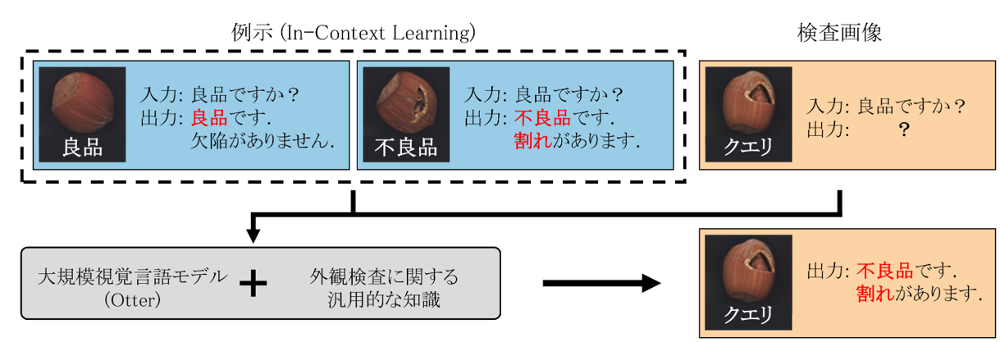
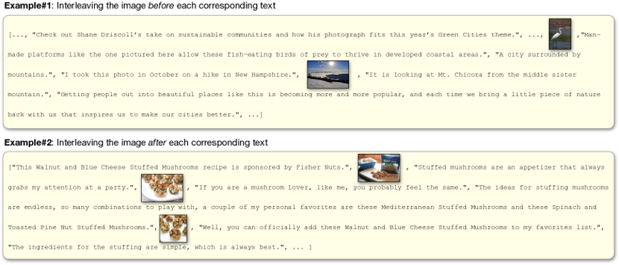
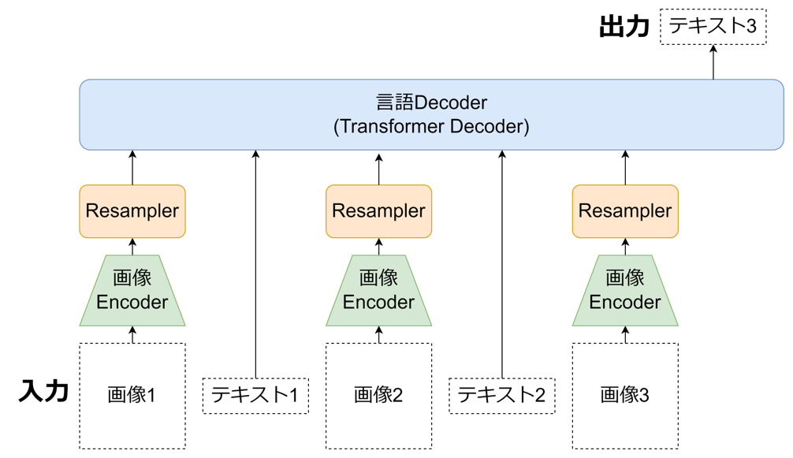
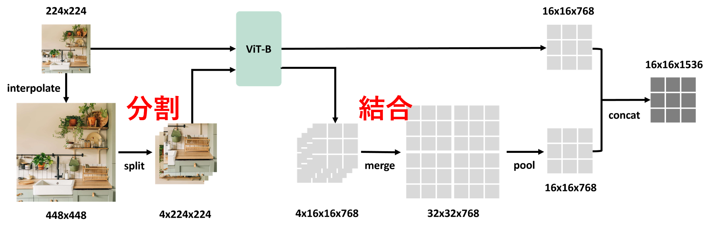
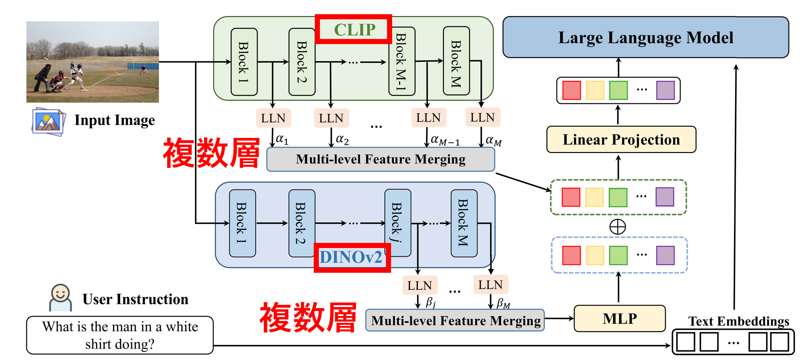

import Link from "@docusaurus/Link"

　現在の修士課程での研究内容は「**視覚言語モデル(VLM)を物体検出を伴う特定の下流タスクにより効果的に適応させるファインチューニング手法の考案**」です。LLMやマルチモーダルモデルは大規模なため、**追加学習には非常に高いコスト**がかかります。**ICL**はモデルに人間がタスクの具体例（入力と出力の例）を見せることで、**モデルの能力を向上し未知タスクも解けるようになる手法**です。下記画像は画像質問応答でのICLの例です。

* 上：[Kosmos-1](https://arxiv.org/abs/2302.14045)でのICLなしのZero-shotの例、下：1つの具体例によるICL(One-shot)の例

　ICLではモデルの重みを更新する追加学習を行う必要がないため、低いコストで目的のタスクにモデルを適用できます。そして、複数画像でのICL可能なマルチモーダルモデルを構築することで、テキストだけでなく画像でも人間が具体例を与えられるようになります。このモデルの実用化例としては、**ICLにより良品と不良品の画像・説明文の例をモデルに見せるだけで未知製品に対する外観検査や官能検査を低コストで行える**ようになることが考えられます。

<!--truncate-->

* 外観検査でのICLによる良否判定のイメージ

<!-- * 官能検査でのICLによる良否判定のイメージ
 -->

  
　既存のモデルではKosmos-1をはじめ、複数画像でのICLを行える視覚言語モデル(VLM)はいくつか存在しますが、これらのモデルには画像の細かいところを見れない・画像と一致しない応答をする「ハルシネーション（幻覚、Hallucination）」を起こすという問題があります。木目画像での官能検査の例などが顕著ですが、モデルの受け入れる画像の解像度が大きい・情報量が多い場合既存のVLMはうまく応答できません。そこで、私は**画像の細かいところを見れて、外観検査や官能検査で高い性能を発揮できるVLMを構築することを目標とした研究**を現在進めています。この研究は私だけでなく3人チーム（私と同じM1「[土田 裕登](https://da-tsuchi.github.io/)」　・ドクター「[梁瀬 和哉](https://k-yanase9.github.io/github.io/#/)」 ）で行ってます、また研究室で外観検査を専攻している学生達にも協力してもらっています。

　現在、私がVLM構築に向けて行っていることは既存手法の調査です。私たちの目指すモデルは以下の機能を持っています。

1. **複数の画像を受け入れ可能(ICL)**
2. **画像の細かいとことを見れる(高解像度対応)**

　そのため現在はデータセット・モデル構造・学習方法の3点を調査しています。

1. **データセット**：画像と言語のインターリーブデータ
2. **モデル構造**
    * 画像エンコーダー+言語デコーダー
    * 画像の細部を見れる手法
3. **学習方法**：画像と言語の対応付け学習→マルチタスク学習→ファインチューニング

　**データセット**は画像と言語が入り混じったデータであるインターリーブデータを取り入れるつもりです。下記のように1データ=「テキストA、画像1、テキストB、テキストC、画像2、テキストD」のような形になっています。

* [MMC4](https://arxiv.org/abs/2304.06939)のインターリーブデータ例

　**モデル構造**は以下のように画像エンコーダーをResampler(Projector)で言語空間にマッピングして言語デコーダーに入力する構造にするつもりです。図中の画像エンコーダーとProjectorはすべて同じ重みと構造を持ちます。画像エンコーダーはCLIPやDINOやSigLIP等のVitエンコーダー、言語デコーダーはLlama系列やPhi-3等のTransformerデコーダーを使用することを考えています。

　**画像の細部を見る手法**には以下のようなものがあります。
1. 高解像度画像を処理
    * ViTの解像度を上げる：　[PaLI-X](https://arxiv.org/abs/2305.18565)(768x768)、[Qwen-VL](https://arxiv.org/abs/2308.12966)
    * 画像を周波数空間で処理：　 [DocPedia](https://arxiv.org/abs/2311.11810) (2560x2560)
    * **分割した画像をViTに入力し出力を結合**： [MM1](https://arxiv.org/abs/2403.09611)(1792×1792)、[S2-Wrapper](https://arxiv.org/abs/2403.13043)、[LLaVA-UHD](https://arxiv.org/abs/2403.11703)
2. 複数の画像エンコーダーの特徴量を利用
    * CLIP+DINOv2：　[Eyes Wide Shut? ](https://arxiv.org/abs/2401.06209)、[COMM](https://arxiv.org/abs/2310.08825)
    * CLIP+Resnet：　[Embodied GPT](https://arxiv.org/abs/2305.15021)
3. 複数層の画像特徴量を利用
    * CLIPの浅い層から深い層の5層分の特徴：　[ViP-LLaVA](https://arxiv.org/abs/2312.00784)
    * **CLIPとDINOの複数層の特徴**：　[COMM](https://arxiv.org/abs/2310.08825)
4. 言語Decoderに直接画像入力
    * 画像パッチをそのままDecoderに入力：　[Otter-HD](https://arxiv.org/abs/2311.04219)、[Fuyu-8B](https://www.adept.ai/blog/fuyu-8b)
5. 可変解像度・アスペクト比対応
    * 解像度に比例して画像トークン数を増やす：  [Idefics2](https://arxiv.org/abs/2405.02246)、[NaViT](https://arxiv.org/abs/2307.06304)、[SORA](https://openai.com/index/video-generation-models-as-world-simulators/#fn-19)

以下に1.と3.の例を載せます。

* 1.[**S2-Wrapper**](https://arxiv.org/abs/2403.13043)：高解像度画像を分割してViTで処理して結合

* 3.[**COMM**](https://arxiv.org/abs/2310.08825)：複数の画像エンコーダー・複数層の画像特徴量

　**学習方法**では以下の3つを行うつもりです。
1. Projectorのみを発火してキャプションデータセット等で画像の言語空間へのマッピングを学習する「**対応付け学習**」
2. 目的の複数のタスク（キャプショニング・画像質問応答・画像分類）を同時に学習し多くの汎用的なタスクを実行できるようにする「<Link to={"/blog/2024/06/09/index"}>**マルチタスク学習**</Link>」
3. 場合によっては個別タスクごとの「**ファインチューニング**」

* マルチタスク学習の例

以上まだ調査の段階ですが、今後具体的な実装・実験を行っていきたいと思います。

