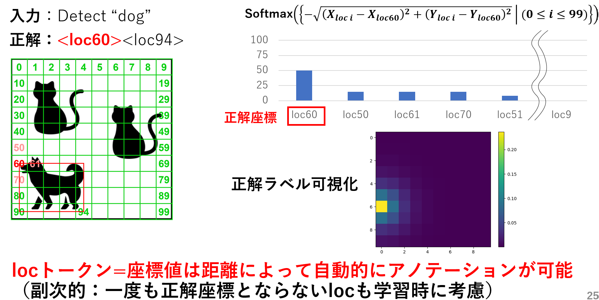

import Link from "@docusaurus/Link"

　現在の修士課程での研究内容は「**視覚言語モデル(VLM)を物体検出を伴う特定の下流タスクにより効果的に適応させるファインチューニング手法の考案**」です。画像と言語を両方扱い多様なタスクを実行できる視覚言語モデル(VLM)は大量のデータで複数のタスクを同時に事前学習しており、下記のようなImage Captioning（画像キャプション生成）・Visual Question Answering（画像に関する質問応答）・Image Classification（画像クラス分類）といった多様なタスクを実行できます。その中には画像中の物体を矩形で囲ってモデルに出力させる**Visual Groundingのような物体検出タスク**も含まれます。

* 上：視覚言語モデル「[OFA](https://proceedings.mlr.press/v162/wang22al.html)」が実行可能な視覚言語タスク一覧

こうした多様なタスクを実行可能なVLMの活用用途として、特定の下流タスクでより高い性能が出せるようにファインチューニング（微調整）して利用することが考えられます。その中には**物体検出を伴う下流タスク**も存在します。物体検出を伴う下流タスクというのは例えばVisual Groundingや下記のような**Grounded Image Captioning**（画像中の物体を含むキャプションを生成し、物体に対応した領域も出力するタスク）が考えられます。  
しかし、こうした下流タスクへモデルを微調整するために必要な学習データセットの作成には、クラス・テキストに対応した画像中の物体がどこにあるかを表す物体領域をバウンディングボックス(bbox)やセグメンテーションマスクのアノテーションが必要になります。**しかし基本的に物体領域のアノテーションコストは高いため、できるだけ少量のデータで下流タスクに適応できるのが望ましいです。**

* Grounted Image Captioningの例（[Kosmos-2](https://arxiv.org/abs/2306.14824)）

  
そのため本研究ではVLMを物体検出を伴う下流タスクに適応させる際、1.**距離反比例ラベル**と2.**GEM損失関数(既存手法)を**用いて通常のOne-hotラベルとCrossEntorpy(CE)損失関数を用いた場合より、**より効果的な微調整手法を提案します**。

* 提案手法概要

<!--truncate-->
<h3>1.距離反比例ラベル</h3>
まず距離反比例ラベルの説明の前にVLMがどのように物体検出を行っているかを解説します。VLMの物体検出方式は様々ありそれぞれ方式が異なります。**本研究では比較的多く見られるbbox座標を特殊トークンを用いてテキスト形式で表すモデル(例えばPix2seq・OFA・Kosmos-2・PaliGemma)を扱います。**  
これらのモデルは以下の"dog"を検出する例のように画像を縦横にパッチに区切りそのパッチを
* A. 左のように行と列のindexで指定する4トークン表現
* B. 右のように左から右、上から下にindexを割り振りindexで指定する2トークン表現

で表します。これにより**VLMは物体検出をLLMがテキストを学習するのと同様に自己回帰的に学習**できます。**以降はパターンBを例として扱います。**

* VLMの物体検出の仕組み

次に現状のOne-hotラベルによるテキスト学習の問題点を紹介します。**VLMやLLMはテキストを今までの文章のもっともらしい次単語を出力するように学習されます**。このもっともらしい次単語は通常1つの単語のみを絶対的な正解とするOne-hotラベルを用いて表されます。  
ここで下記のような「"apple"は日本語で…」の次単語予測を行う場合を考えています。この場合左のようにOne-hotラベルは"りんご"のみを絶対的な正解として扱います。しかし文脈上は右のように"林檎"や"リンゴ"も正解として良いはずです。このように**One-hotラベルを使用した学習は特定の一単語のみに大きな確率を割り振って学習するため学習データに過適合し、様々な単語を出力する多様性が失われる問題**があります。

* One-hotラベルによるテキスト学習の問題点

この問題は下記に示すようにテキスト形式で物体検出タスクを行う際に問題となります。例えば"dog"の左上\<loc60\>の座標の正解ラベルを考える場合、One-hotラベルは右上のように1つの座標のみを絶対的な正解とします。しかし右下のように\<loc60\>の周辺の\<loc50\>・\<loc61\>・\<loc70\>もある程度の正解としていいはずです。**つまりlocトークンにも距離に応じて全座標に距離に応じて適切な確率を割り振る必要があると考えました。**

* One-hotラベルによる物体検出学習の問題点

そこで提案手法では下記のように正解座標からの距離に応じ全座標に確率を割り振った**距離反比例ラベル**を正解ラベルとして用いることで、**距離を意識した学習により学習データへの過適合を減らそうと考えています。**

* 距離反比例ラベルの提案

<h3>2. GEM損失関数（既存手法）</h3>
GEM損失関数は「[Entropic Distribution Matching in Supervised Fine-tuning of LLMs: Less Overfitting and Better Diversity](https://arxiv.org/abs/2408.16673)」という論文で提案された損失関数です。論文では既存のCrossEntorpy損失による事前学習済みLLMのSupervised Fine-Tuning(知識はあるが具体的なタスクは出来ないLLMを会話や数学タスクやコーディングなどのタスクが行えるように学習する)を行うと、事前学習データに比べてSFTデータの量が少ないことにより、学習データへ過適合し出力の多様性が失われると述べています。  
そのためGEM損失は下記のように正解と自身の生成分布両方から学習する**リバースKLダイバージェンス**と生成分布が1つの単語に偏った出力とならないようにする**エントロピー正則化**から構成されており、**学習データへの過適合を減らし生成分布に多様性を持たせる（生成分布を平坦化）する効果があります。**

* GEM損失関数の概要

**本研究ではテキストタスクで有効性の測れていたGEMを、テキストと画像を両方利用する物体検出（視覚言語）タスクに適応しその有効性を調査します。**  
下記に具体的に期待している効果を示します。CrossEntropy損失とGEM損失でそれぞれ学習したモデルに"GIve me a single-digit number"(1桁の整数を答えてください)の次単語予測を行わせると、CrossEntropy損失が"9"しか生成分布の上位に持ってこれないのに対し、GEM損失は"7"と"3"の2つを上位に持ってきており、また生成分布を平坦化しています。この**適切な次単語を複数候補上位に持ってくる生成分布となるように学習するのと同様の効果を、locトークンで行った場合にも期待して利用します。**

* 物体検出タスクでGEMに期待する効果

<h3>まとめ</h3>
今後は1.**距離反比例ラベル**がOne-hotラベルより有効か、2.物体検出タスクにおいて**GEM損失**がCrossEntropy損失より有効かを、実際の物体検出データセットとモデルを用いて確かめ、**提案手法が物体検出を伴う下流タスクにVLMをファインチューニングする際により効果的であることを示したい**と考えています。

